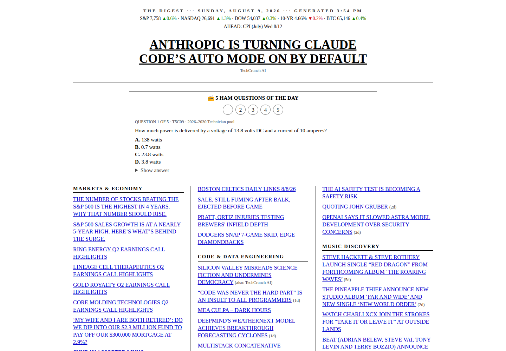

# myfeed

**A finite, self-hosted news digest with transparent scoring and no infinite scroll.**

[](https://www.python.org/)
[](Dockerfile)
[](LICENSE)



`myfeed` pulls the RSS feeds you choose, scores recent headlines against your
interests, and renders roughly 18 links into one plain HTML page. Read it,
close it, and get on with the day.

## Why it exists

- **Finite by design** — a hard item cap and freshness window make the page end.
- **User-controlled sources** — RSS and Atom feeds live in one configuration file.
- **Transparent ranking** — source weight, keyword matches, and age determine the score.
- **No accounts** — the local script does not need a platform identity.
- **Self-hostable** — generate a static file or run the included container and server.
- **Graceful degradation** — optional market, sports, and paper sources disappear cleanly when unavailable.

## Run locally

Requires [uv](https://docs.astral.sh/uv/). The executable script declares its
Python dependency inline.

```bash
git clone https://github.com/wtbates99/myfeed.git
cd myfeed

./digest.py            # generate digest.html and open it
./digest.py --no-open  # generate only
```

Edit `feeds.toml` before treating the output as your feed. The repository's
configuration is an example of one person's interests, not a universal ranking.

## Ranking model

The score is intentionally understandable:

```text
source weight + boost keyword hits - bury keyword hits - age / 12 hours
```

Configuration controls:

- `[[source]]` defines a feed, topic, and source weight.
- `boost` contains terms that add two points per match.
- `bury` contains terms that subtract five points per match.
- `max_items` caps the digest.
- `max_age_hours` sets the freshness window.

Each active topic can receive a slot when it has a sufficiently strong item;
quiet topics are not padded with stale filler.

## Optional context

The rendered page can include:

- major-market and Bitcoin snapshots;
- configured team records and upcoming games;
- a cached arXiv paper of the week;
- five recent archived editions;
- local click counts that can inform future ranking.

These integrations use third-party endpoints and may change independently.
Failures do not prevent the core RSS digest from rendering.

## Docker deployment

```bash
docker build -t myfeed:local .
docker run --rm -p 8484:8484 -v myfeed-data:/data myfeed:local
```

The container regenerates the digest every three hours. `serve.py` serves `/`,
the recent archive, and a click-logging redirect backed by the mounted data
volume.

## Privacy and operational notes

- Feed requests reveal the server's IP address to the configured publishers.
- Optional market, sports, and paper requests contact their respective providers.
- Click history remains in the configured local or mounted data directory.
- The generated digest contains live third-party headlines; do not commit it.
- README screenshots use the repository's example configuration and contain no click history.

## Validation

```bash
python -m py_compile digest.py serve.py
./digest.py --no-open
python serve.py 8484
```

Open <http://127.0.0.1:8484> and verify the digest, archive, redirect, and
fallback behavior.

## License

`myfeed` is **source available** under the
[PolyForm Noncommercial License 1.0.0](LICENSE). Personal and noncommercial
use is permitted under those terms. Commercial use requires a
[separate license](COMMERCIAL-LICENSE.md).
